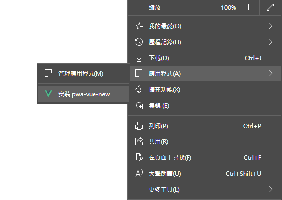
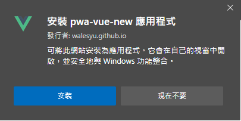
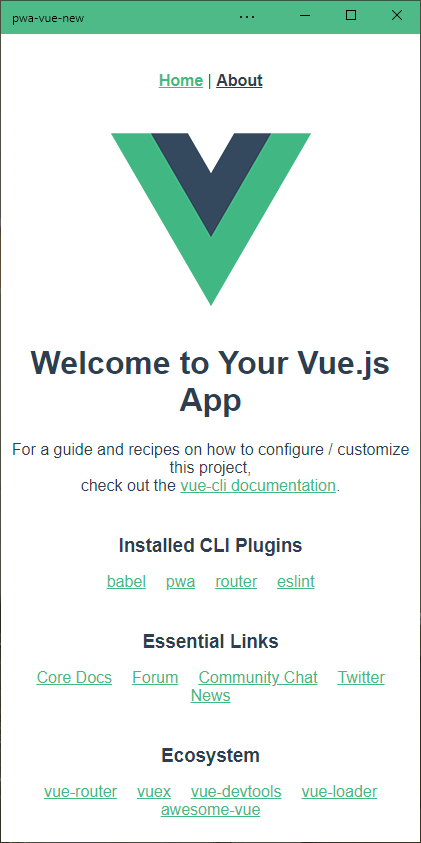

PWA Sample of Vue
---

## PWA 
Progressive Web Apps(漸進式網頁應用程式)： 利用現有的網頁技術，達到原生APP可以做到的展示效果。大致包含了：
- 全螢幕顯示網頁畫面
- 暫存機制
- 離線瀏覽
- 可安裝
- 自適應網頁設計
- 訊息推送
- ..

## 構成要素
### manifest.json
 - 一個用來描述網站App的組成要素，像是icon、網站起始位置、作者、版本等
 - 詳細設定請參照 [MDN](https://developer.mozilla.org/zh-TW/docs/Mozilla/Add-ons/WebExtensions/manifest.json)
``` json
{
  "name": "pwa-vue",
  "short_name": "vue",
  "theme_color": "#4DBA87",
  "icons": [
    {
      "src": "./img/icons/android-chrome-192x192.png",
      "sizes": "192x192",
      "type": "image/png"
    },
    {
      "src": "./img/icons/android-chrome-512x512.png",
      "sizes": "512x512",
      "type": "image/png"
    },
    {
      "src": "./img/icons/android-chrome-maskable-192x192.png",
      "sizes": "192x192",
      "type": "image/png",
      "purpose": "maskable"
    },
    {
      "src": "./img/icons/android-chrome-maskable-512x512.png",
      "sizes": "512x512",
      "type": "image/png",
      "purpose": "maskable"
    }
  ],
  "start_url": ".",
  "display": "standalone",
  "background_color": "#000000"
}
 ```
- 設定好的網頁可以安裝成web app

  
- 確認安裝

  
- 當web app被執行時會隱藏網址列

  

### service worker
- service worker 是一個在瀏覽器背景執行的script，讓使用在不需要開啟網頁UI的情況下執行諸如推播服務或是背景同步的動作。
- 利用service worker可以建構離線瀏覽功能
- 目前已支援的瀏覽器: Chrome, Firefox, Opera, Edge(新版), safari.. [check here](https://caniuse.com/serviceworkers)
- service worker 必須使用https(localhost 可以不用)
#### service worker的事件
 - service worker支援許多事件，挑選幾項說明詳細請參照 [MDN](https://developer.mozilla.org/en-US/docs/Web/API/ServiceWorkerGlobalScope)
 - install: 安裝service worker
    - 開啟cache並寫入cache資料
 - fetch: 當使用者連到網站的另一個頁面或refresh時
    - 檢查cache是否存在，並將cache回傳給browser
    - 沒有cache時向主機發起request，回應為200時將回應寫入cache並回傳給browser
 - push: 當取得推播通知時觸發

## demo
   [demo site](https://walesyu.github.io/vue-pwa/)
## 執行專案

```
npm run serve
```

## 建立build好的js檔
```
npm run build
```
**建好的檔案會放在docs**
